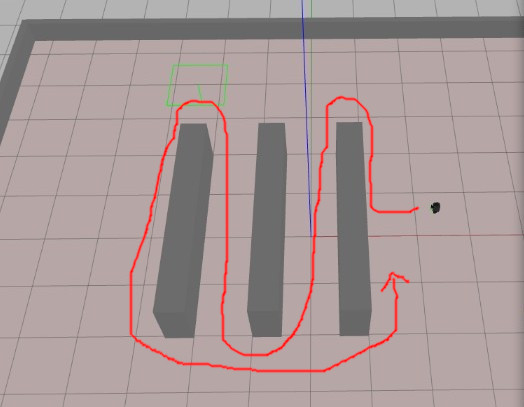

# Robótica Computacional 2022.2

## Avaliação Intermediária (P1)

**Indique seu nome e as questões que escolheu fazer logo abaixo. Você deve escolher 4 questões, senão o avaliador o fará por você.**

Nome:_______________

Questões que fez:____________

** Embora não seja obrigatório, recomendamos que grave e publique um vídeo do robô rodando no Gazebo demonstrando o funcionamento das questões 4 e 5 **

Para gravar video no Linux: `Ctrl + Alt + Shift + R`

Para remover o limite de tempo de gravação: digitar o comando abaixo no terminal

    gsettings set org.gnome.settings-daemon.plugins.mediakeys max-screencast-length 0

Link para o vídeo da questão 4: __________________

Link para o vídeo da questão 5: __________________

**Observações de avaliações nesta disciplina:**

* Clone o repositório da prova dentro de `~/catkin_ws/src` se estiver trabalhando no Linux.
* Você poderá dar quantos `git push` quiser no repositório, apenas o último será considerado.
* Antes de finalizar a prova verifique que os arquivos enviados ao github estão na sua última versão. É sua responsabilidade garantir isso.
* Só finalize a prova no Blackboard após enviar a prova via Github classroom.
* Ponha o nome no enunciado da prova no Github
* Tenha os repositórios https://github.com/Insper/robot22.2/ ,  https://github.com/arnaldojr/my_simulation e https://github.com/arnaldojr/mybot_description.git  atualizados em seu `catkin_ws/src`.
* Você pode consultar a internet ou qualquer material, mas não pode se comunicar com pessoas ou colegas a respeito da prova
* Todos os códigos fornecidos adicionalmente aos scripts em que as questões serão desenvolvidas foram testados em outro contexto, e são apenas um compilado. Não é obrigatório usar. Fique à vontade para modificar esse código e trazer outros arquivos que achar melhor. 
* Teste sempre seu código
* Entregue código que executa - código com erro que impede de executar implica em zero na questào
* Faça commits e pushes frequentes no seu repositório (tem dicas [no final deste arquivo](./instrucoes_setup.md))
* Permite-se consultar qualquer material online ou próprio. Não se pode compartilhar informações com colegas durante a prova.
* Faça commits frequentes. Em caso de disputa sobre plágio, o primeiro a enviar alguma ideia será considerado autor original.
* A responsabilidade por ter o *setup* funcionando é de cada estudante.
* Questões de esclarecimento geral podem ser perguntadas em voz alta na sala de aplicação da prova. Uma mesma pergunta não será respondida duas vezes.
* É proibido colaborar ou pedir ajuda a colegas ou qualquer pessoa que conheça os assuntos avaliados nesta prova.
* Os exercícios admitem diversas estratégias de resolução. A prova de cada aluno é única. Atenha-se apenas à rubrica de cada questão.

Existe algumas dicas de referência rápida de setup [instrucoes_setup.md](instrucoes_setup.md)

**Integridade Intelectual**

Se você tiver alguma evidência de fraude cometida nesta prova, [use este serviço de e-mail anônimo](https://www.guerrillamail.com/pt/compose)  para informar ao professor através do e-mail `antoniohps1@insper.edu.br`.

# Questões

## Questão 1  (2.50 pontos)

Você foi contratado por uma empresa de games *retrô* para desenvolver um sistema de análise do jogo **Enduro**, desenvolvido para o console Atari 2600.

A empresa quer contar o número de carros presentes na tela, quantos foram ultrapassados, quando o carro bateu e qual é a profundidade dos carros no jogo. A Activision (desenvolvedora do Enduro) ajusta o tamanho do carro de acordo com a distância dele até a câmera. Para o carro branco sendo controlado, considere que a profundiade dele é 10 m, e sua largura real é de 1,5 m. Seu prograam deverá funcionar para todos os ambientes simulados no jogo, que no vídeo fornecido são: manhã, neve e fim de tarde

### O que você deverá fazer

Você deverá editar o arquivo `q1.py` para  escrever na própria tela o número de carros presentes. Também escreva, para cada carro a profundiade deles, ou seja, qual é a distância anté a câmera. E por fim, para cada carro que estiver sendo utrapassado, pinte-o de vermelho.

#### Orientações

Trabalhe no arquivo `./q1/q1.py`. Este exercício **não precisa** de ROS. Portanto pode ser feito até em Mac ou Windows

#### Rubricas:

|Resultado| Conceito| 
|---|---|
| Não executa | zero |
| Determina a distância focal da câmera virtual | 0.5|
| Segmenta e conta todos os carros na pista, mostrando evidências, em pelo menos um ambiente | 1.0|
| Identifica as profundidades dos carros e escreve na tela, em pelo menos um ambiente | 1.7 |
| Todas as rubricas acima e também identifica os carros sendo ultrapassados, em pelo menos um ambiente | 2.0 |
| Funciona para todos os ambientes | +0.5 |

Casos intermediários ou omissos da rubrica serão decididos pelo professor.

## Questão 2  (2.50 pontos)

A mesma empresa que te contratou na questão 1 quer avaliar o estilo de jogo das pessoas. Então ela quer saber quando o carro está mais para a direita ou mais para a esquerda na pista, be como quando há uma curva virando à direita ou à esquerda.

#### Orientações

Trabalhe no arquivo `q2/q2.py`. Este exercício **não precisa** de ROS. Portanto pode ser feito até em Mac ou Windows

#### O que você deve fazer:

Escreva na tela se o carro está mais à direita ou mais à esquerda na pista, levando em consideração os pontos onde as guias encontram a parte de baixo da tela. Escreva também se a curva é para a direita, para a esquerda, ou se há um trecho de pista reta. Para facilitar, a imagem pode ser cortada numa altura em que as guias laterais se pareçam razoavelmente com retas.

|Resultado| Conceito| 
|---|---|
| Não executa | zero |
| Segmenta as linhas e mostra saída visual | 0.6|
| Identifica as retas das guias e apresenta saída visual das mesmas| 1.2|
| Apresenta na tela o ponto de fuga das guias | 1.8|
| Escreve na tela as situações pedidas no enunciado | 2.2|
| Funciona para todos os ambientes | +0.3 |

Casos intermediários ou omissos da rubrica serão decididos pelo professor.

## Questão 3  (2.50 pontos)

Nesta questão você irá checar qual alvo se aproxima e se a mira laser composta por um círculo e um *crosshair* está acertando esse alvo. A direção do laser é definida pela linha ligando o centro do círculo ao centro do crosshair.

### O que você deverá fazer

Você precisará encontrar qual é o tipo de alvo e escrever na tela. Então, verifique se a linha reta que liga o centro da circunferência ao centro do crosshair passa por dentro do retângulo do alvo. Essa verificação pode ser feita verificando se algum dos pontos de cima do objeto está acima da reta e algum dos pontos de baixo do objeto se encontra abaixo da reta.

Caso o laser acerte o alvo, escreva "ACERTOU X" na tela, onde X deve ser substituído pelo nome do alvo. 

#### Orientações

Trabalhe no arquivo `./q3/q3.py`, dentro da função `laser_acertou()`. Este exercício **não precisa** de ROS. Portanto pode ser feito até em Mac ou Windows. Antes de tudo rode o arquivo para checar se o video é mostrado. 

#### O que você deve fazer:

|Resultado| Conceito| 
|---|---|
| Não executa | zero |
| Identifica corretamente o tipo de alvo  e seu retângulo envolvente, escrevendo na tela | 0.5 |
| Identifica o alvo e o centro da circunferência da mira, com saída visual | 1.0 |
| Identifica corretamente o centro do *crosshair*, com saída visual  |+1.0|
| Identifica o alvo e desenha a reta que liga o centro do crosshair e o centro do circulo  |2.2|
| Detecta corretamente se o laser acerta o alvo, com mensagem na tela, mantendo todas as outras saídas visuais pedidas| 2.5 |

Casos intermediários ou omissos da rubrica serão decididos pelo professor.

## Questões de ROS

**Atenção: ** 

Para fazer estas questões você precisa ter o `my_simulation` e o `mybot_description` atualizado.

    cd ~/catkin_ws/src
    cd my_simulation
    git stash
    git pull

Ou então se ainda não tiver:

    cd ~/catkin_ws/src
    git clone https://github.com/arnaldojr/my_simulation.git

Para o mybot_description:

    cd ~/catkin_ws/src
    cd mybot_description
    git stash
    git pull

Ou então se ainda não tiver:

    cd ~/catkin_ws/src
    git clone https://github.com/arnaldojr/mybot_description

Em seguida faça o [catkin_make](./instrucoes_setup.md). 

## Questão 4 (2.50 pontos)

</img>

Seu robô está no cenário visível abaixo:

    roslaunch my_simulation caixas.launch

#### O que é para fazer

Faça o robô visitar as duas caixas magenta, e depois as duas caixas amarelas, não importando a ordem das caixas de uma mesma cor. Porém as caixas magenta devem ser visitadas primeiro. Visitar significa: chegar pŕoximo à caixa, a uma distância menor do que 30 cm. Para alinhar o robô e se aproximar das caixas, use o controle proporcional.

#### Detalhes de como rodar

Para responder à questão você deverá trabalhar em `p1_222/scripts/q4.py`:

Para rodar, recomendamos que faça:

    roslaunch my_simulation caixas.launch

Depois:

    rosrun p1_222 q4.py

|Resultado| Conceito| 
|---|---|
| Não executa | 0 |
| Segmenta corretamente pelo menos a cor magenta | 0.5 |
| Visita apenas uma caixa magenta, mas sem controle proporcional  | 1.0 |
| Visita apenas uma caixa magenta, com controle proporcional  | 1.5 |
| Visita apenas as caixas magenta | 2.0 |
| O robô visitar todas as caixas na ordem de cores correta | 2.5|
| Desconto caso não use o controle proporcional | -0.5|

Casos intermediários ou omissos da rubrica serão decididos pelo professor.

## Questão 5 (2.50 pontos)

</img>

Seu robô está no cenário visível abaixo:

    roslaunch my_simulation paralelas.launch

#### O que é para fazer

Usando o lidar, faça um zigue-zague percorrendo o espaço entre as paredes e voltando, seguindo o trajeto indicado na figura. Você pode usar o *dead-reckoning* ("robô cego", usando o `rospy.sleep()`) apenas para girar o robô em algum ângulo determinado. 

#### Detalhes de como rodar

O código para este exercício está em: `p1_222/scripts/q5.py`

Para rodar, recomendamos que faça:

    roslaunch my_simulation paralelas.launch

Depois:

    rosrun p1_222 q5.py

|Resultado| Conceito| 
|---|---|
| Não executa | 0 |
| O robô cumpre a tarefa apenas com *dead reckoning*  (`rospy.sleep()`)| 1.0 |
| Faz o robô passar apenas entre as duas primeiras paredes, usando lidar  | 1.5 |
| Fazer apenas o caminho de ida, mas não consegue voltar, usando lidar | 2.0|
| Vai e volta seguindo o caminho especificado, usando lidar | 2.50|

Casos intermediários ou omissos da rubrica serão decididos pelo professor.

**Boa sorte!!**